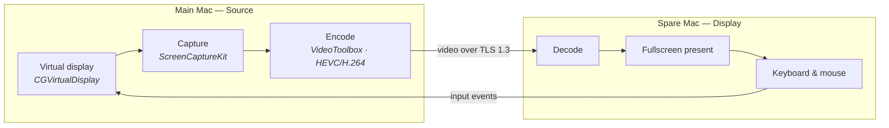

# Sidewire

**Give your main Mac a second screen — using a Mac you already own.**

Sidewire turns a spare Mac into a real extra display for your primary one, over a direct
Thunderbolt cable or over Wi‑Fi. Not screen sharing: macOS treats it as an actual second monitor,
so you drag windows onto it, and your keyboard and mouse work across both machines.



The link is encrypted with certificate-based **TLS 1.3**, and the two machines pair once with a
6-digit PIN through a **CPace PAKE** — the PIN never crosses the wire, and a wrong guess cannot be
brute-forced offline from a captured session.

---

## Status

**Pre-release. Build it from source — there is no download.**

The code is complete and covered by tests, but it has never run on two physical Macs. Take that
seriously before relying on it.

| | |
| --- | --- |
| **Works** | The full macOS Source ↔ Display pipeline, pairing, reconnect, adaptive bitrate, Settings |
| **Tested** | 40 + 39 Swift tests, 80 Rust tests, and a byte-exact protocol suite both implementations reproduce independently |
| **Never run** | Two physical Macs. Live interop between the Rust client and the Swift app |
| **Not shipped** | No release, no signed or notarized build, no Windows/Linux binary |

There is no notarized DMG and none is planned for now, so building from source is the only way to
run it. That is fine for your own machines — an app you build locally is not quarantined, and
Gatekeeper does not block it. [`TODO.md`](TODO.md) tracks everything that is left.

---

## Build it

**You need:** macOS 14 or newer on both Macs, Xcode 16+, and
[XcodeGen](https://github.com/yonaskolb/XcodeGen).

```bash
git clone https://github.com/lunindev/sidewire.git
cd sidewire/app

brew install xcodegen
xcodegen generate          # .xcodeproj is generated, not committed

xcodebuild -project Sidewire.xcodeproj -scheme Sidewire -configuration Release \
  -destination 'generic/platform=macOS' -derivedDataPath build/dd build

open build/dd/Build/Products/Release/Sidewire.app
```

`-destination 'generic/platform=macOS'` is **required**. Without it `xcodebuild` builds only your
own architecture, and the result will not run on the other Mac if it is a different one. Check:

```bash
lipo -archs build/dd/Build/Products/Release/Sidewire.app/Contents/MacOS/Sidewire
# → x86_64 arm64
```

Copy `Sidewire.app` to the second Mac however you like — AirDrop, a shared folder, a USB stick —
and open it there too. You need the app running on **both** machines.

> The checked-in project signs ad‑hoc so it builds for anyone with no Apple account. The trade-off
> is that macOS re-asks for Screen Recording and Accessibility on every rebuild. If that gets old,
> pass your own identity instead of editing the project:
> `xcodebuild … CODE_SIGN_IDENTITY=<your-sha1> CODE_SIGNING_REQUIRED=YES`.

---

## Use it

1. **Open Sidewire on both Macs.** A first-run screen explains the two roles.
2. **Pick roles.** On the Mac that should *gain* a screen, choose **Source**. On the spare Mac,
   choose **Display**.
3. **Pair them.** The Display shows a 6-digit PIN. Type it on the Source. This happens once per
   pair of machines — after that they reconnect without it.
4. **Connect.**
   - **Thunderbolt cable** — lowest latency, and the reason this project exists. With a cable
     plugged in, the Source shows a green **⚡ Thunderbolt** button. One click.
   - **Wi‑Fi** — pick the Display from the discovered list and press **Connect**.
5. **Use it as a monitor.** The Source creates a virtual display, so it appears in
   *System Settings → Displays* like any external screen. Arrange it there.

Press **Esc** on the Display to hand the keyboard and mouse back to that machine.

**First launch asks for permissions.** The Source needs *Screen Recording* (to capture the virtual
display) and *Accessibility* (to inject the keyboard and mouse it receives). Both Macs need *Local
Network*. macOS requires a relaunch after granting Screen Recording; the app prompts you.

**Settings (⌘,)** — codec (HEVC or H.264), resolution, maximum frame rate and bitrate, auto-connect
to the last Mac on launch, and a menu-bar-only mode.

### A Windows or Linux machine as the second screen

There is a native Rust client in
[`app/clients/sidewire-viewer/`](app/clients/sidewire-viewer/) that speaks the identical wire
protocol. It builds and its tests pass, but **no Windows or Linux binary has ever been produced and
it has never been tested against a live Mac**, so treat it as work in progress rather than a
feature. Build instructions are in
[its README](app/clients/sidewire-viewer/README.md).

The machine that *gains* a screen is always a Mac — creating a virtual display is macOS-specific.

---

## How it works

The Source creates a virtual display with the private `CGVirtualDisplay` API, captures it with
ScreenCaptureKit, and encodes it with VideoToolbox — hardware HEVC, or H.264 where that is faster.
Frames go over a single TCP connection wrapped in TLS 1.3. The Display decodes, presents
fullscreen, and sends input events back, which the Source injects into the virtual display.

Two details matter more than the rest:

- **Reconnection is a first-class subsystem, not an afterthought.** An application-level heartbeat,
  watchdogs for stalled frames and stalled encoders, and a recovery ladder that survives a cable
  pull, a sleep/wake cycle and a half-open socket.
- **The pointer does not go through the video.** The Source reports cursor position out of band and
  the Display warps its own native cursor, so the pointer tracks at network latency instead of
  decode latency.

Sidewire makes exactly one network request that is not to your other Mac: Sparkle's update check,
which is opt-in and off by default. No accounts, no analytics, no telemetry.

The full design lives in [`app/docs/`](app/docs/README.md) — read
[00-decisions.md](app/docs/00-decisions.md) first, and
[08-status-and-gaps.md](app/docs/08-status-and-gaps.md) for what is actually verified.

---

## Repository layout

```
app/                      the product
  Sidewire/               macOS app (SwiftUI, Universal 2, macOS 14+)
  Packages/               SidewireProtocol (wire format) · SidewireCore (transport, session, crypto)
  clients/                Rust Windows/Linux client
  protocol-vectors/       byte-exact conformance fixtures shared by both implementations
  docs/                   the design specification
landing/                  marketing site (Astro, static) — not deployed
scripts/                  version bump + changelog + tag
```

## Contributing

Build instructions, test commands and conventions are in [`CONTRIBUTING.md`](CONTRIBUTING.md).
Security reports go through [`SECURITY.md`](SECURITY.md) — please do not open a public issue for a
vulnerability. Third-party attribution is in
[`THIRD-PARTY-LICENSES.md`](THIRD-PARTY-LICENSES.md).

## License

[GNU General Public License v3.0 or later](LICENSE).

You may use, study, modify and redistribute Sidewire freely, and it comes with no warranty of any
kind. The one obligation the GPL adds: if you distribute it, or anything derived from it, you must
make the corresponding source available under the same licence. Using or modifying it privately
carries no such requirement.

The choice is also practical. The Rust client links FFmpeg, and the readily available FFmpeg builds
are themselves GPL — so any distributed binary would be governed by the GPL regardless. Matching the
project licence to that reality keeps the source and the binaries under one consistent set of
terms.
